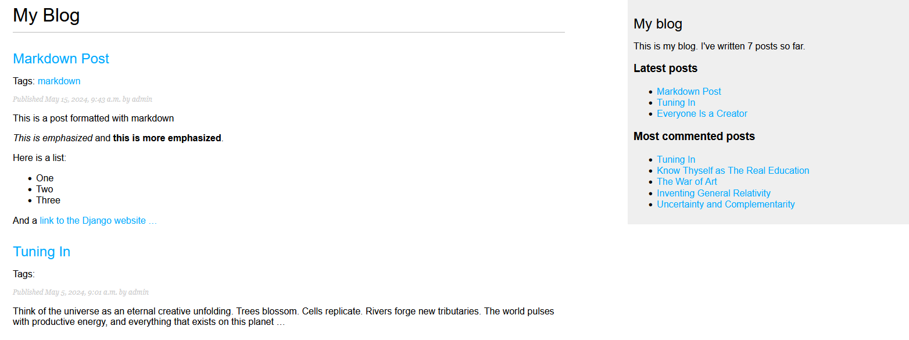
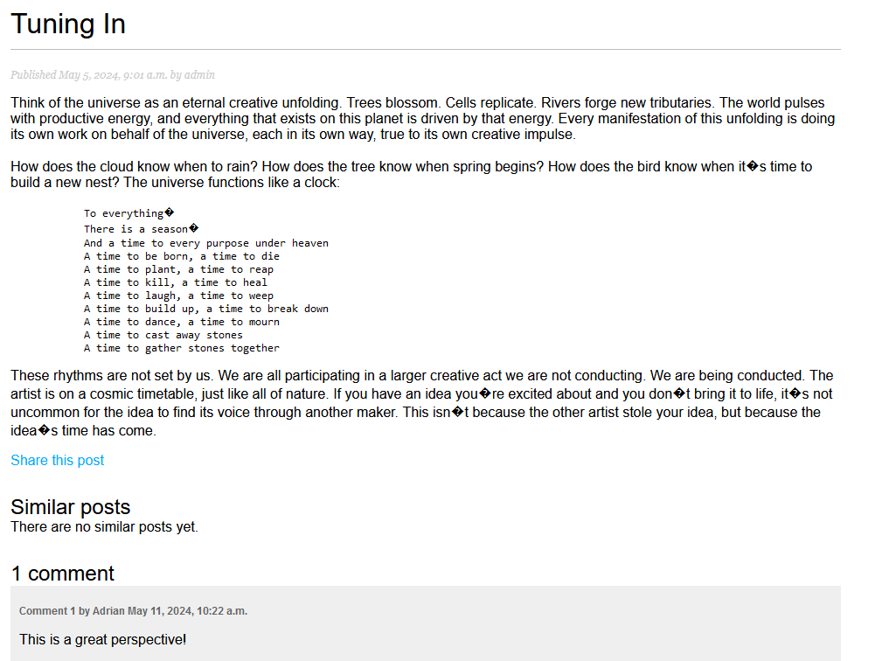
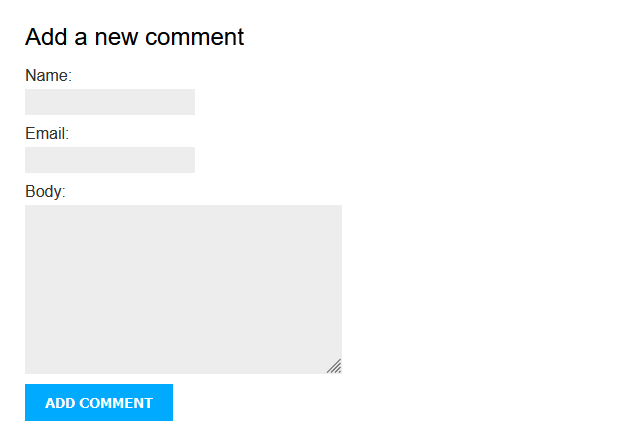
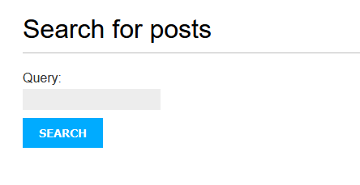

Simple Django Blog

This is a simple Django blog application created as a learning project to demonstrate how to build a static website using Django.
Table of Contents

    Simple Django Blog
        Table of Contents
        Introduction
        Features
        Installation
            Prerequisites
            Clone the Repository
            Create and Activate a Virtual Environment
            Install Dependencies
            Set Up the Database
            Configure the Django Project
            Apply Migrations
            Create a Superuser
            Run the Development Server
        Usage
        Contributing
        License
        Contact

Introduction

This project is a simple blog application built with Django. It includes features such as admin authentication, posting and managing blog posts, tagging, search functionality, and comment management. It is designed to serve as a learning tool for those new to Django or web development in general.
Features

    User authentication and authorization
    Creating, editing, and deleting blog posts
    Tagging system using django-taggit
    Search functionality with django.contrib.postgres.search
    RSS feed for latest posts
    Comment system with moderation
    Email sharing of posts
    Pagination for blog posts
    Display of similar posts based on tags
    Display of most commented posts

    Here are sample images of how the Django project looks like and the features it has. Note that no frontend framework has been used to customize the blog.

In this first image is the blog homepage, showing the list of the first page of posts, and the sidebar with the latest posts and most commented posts. Each post in the list has its publishing date, author, and the tags associated with it. At the bottom, there is the pagination, where a user can click to see the next page of posts

Second image: Sample post with a comment and a button to share the post, which would share it via email

Third image: Comment form for users to add comments

Fourth image: Form to search for posts using keywords. The search is a little advanced, searching using both title and body, but weighing in more on the title.

Installation
Prerequisites

Make sure you have the following software installed on your machine:

    Python (version 3.8 or higher)
    PostgreSQL (version 12 or higher)
    Git

Clone the Repository

sh

git clone https://github.com/GachewaRa/your-repository.git
cd your-repository

Create and Activate a Virtual Environment

sh

python -m venv venv
source venv/bin/activate  # On Windows use `venv\Scripts\activate`

Install Dependencies

sh

pip install -r requirements.txt

Set Up the Database

Make sure PostgreSQL is running, then create a database:

sh

psql
CREATE DATABASE blog;
CREATE USER bloguser WITH PASSWORD 'yourpassword';
ALTER ROLE bloguser SET client_encoding TO 'utf8';
ALTER ROLE bloguser SET default_transaction_isolation TO 'read committed';
ALTER ROLE bloguser SET timezone TO 'UTC';
GRANT ALL PRIVILEGES ON DATABASE blog TO bloguser;

Configure the Django Project

Rename .env.example to .env and fill in your database credentials:

plaintext

DEBUG=on
SECRET_KEY=your_secret_key
DB_NAME=blog
DB_USER=bloguser
DB_PASSWORD=yourpassword
DB_HOST=localhost
DB_PORT=5432

Apply Migrations

sh

python manage.py migrate

Create a Superuser

sh

python manage.py createsuperuser

Run the Development Server

sh

python manage.py runserver

Visit http://127.0.0.1:8000/ to see your project in action.
Usage

The main functionalities of this blog application include:

    Post List and Detail Views: Browse through the list of posts and view individual post details, including comments and similar posts.
    Search Functionality: Search for posts containing specific keywords.
    Commenting System: Users can add comments to posts.
    Tagging: Posts can be tagged, and users can filter posts by tags.
    Email Sharing: Share posts via email.
    RSS Feed: Subscribe to the blog's RSS feed to get the latest posts.

Contributing

If you want to contribute to this project, please follow these steps:

    Fork the repository
    Create a new branch (git checkout -b feature-branch)
    Make your changes and commit them (git commit -m 'Add new feature')
    Push to the branch (git push origin feature-branch)
    Create a Pull Request

License

This project is licensed under the MIT License. See the LICENSE file for details.
Contact

If you have any questions or suggestions, feel free to contact me:

    Email: gachewaadrian@gmail.com
    GitHub: GachewaRa